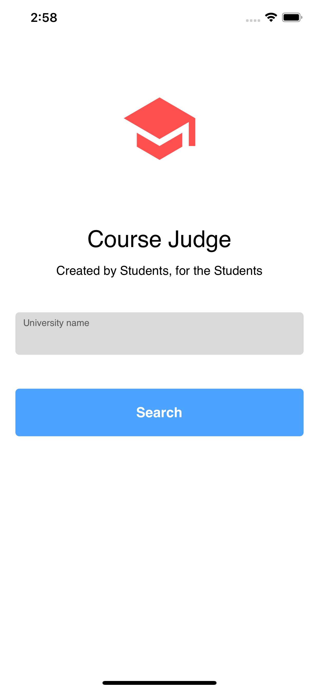
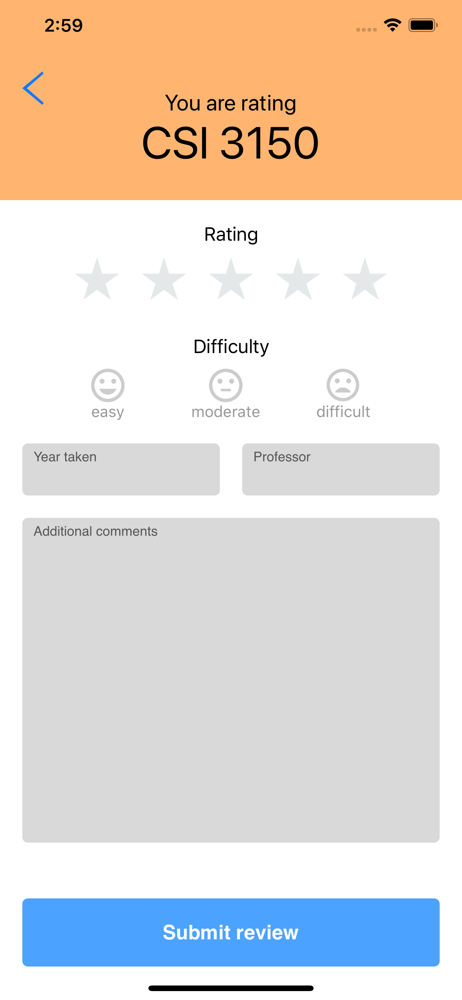

# 

# 
CourseJudge

The application *Course Judge* allows students to search for a class (course name or course code) so that they can look at the reviews of the course from other students who took it previously. Students can evaluate and judge the difficulty level, amount of work, usefulness, etc. Through these reviews for specific classes they are interested in taking. 

Our overall goal is to provide an easily accessible and easy to use application where students can share reviews of courses so that other students can decide, or just prepare for, on a class they want to take. 

  

  
  

## Screenshots

  

    
  

  

  
  

## Languages

  - Swift

## Contributors
  
  :bowtie: Michel Balamou

  :trollface: Nathanael Adams

  :information_desk_person: Charmaine Deramos
